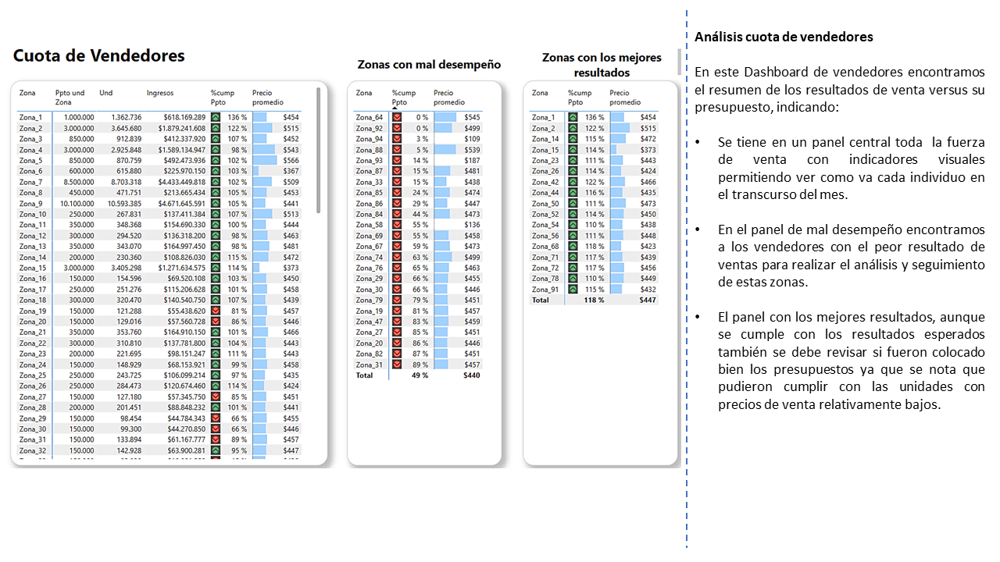

# Proyecto Final ETL - Análisis de Ventas en una empresa Avicola

Este proyecto ETL tiene como objetivo procesar, limpiar, transformar y anonimizar una base de datos de ventas de una empresa avicola que comercializa huevo, para luego visualizar en un dashboard y analizar en Power BI.

---

## Estructura del Proyecto

```
ETL_PROYECTO/
├── codigo/                     # Scripts de transformación y verificación
│   ├── transformar.py
│   └── verificar.py
│
├── datos/
│   ├── originales/             # Datos desde el ERP SAP
│   │   └── FLASH BI.xlsx
│   └── transformados/         # Datos Limpios y transformados
│       └── flash_bi_limpio.csv
│
├── presupuestos/              # Archivos con presupuestos de ventas
│   ├── PPTO_DISTRITOS.xlsx
│   └── PPTO_zona.xlsx
│
├── Visualizacion/             # Dashboard en Power BI
│   └── dashboard ventas.pbix
│
├── principal.py               # Script principal
├── README.md                  # Documentación general
└── requisitos.txt             # Dependencias
```

---

## Requisitos

Para ejecutar este proyecto necesitas tener instalado:

- Python 3.10 o superior
- pandas
- openpyxl

Instala los paquetes con:

```bash
pip install -r requisitos.txt
```

---

## Proceso ETL

### 1. Extracción
- Se extrae del ERP SAP con la aplicacion crystal reports de diferentes tablas
- Archivo fuente: `FLASH BI.xlsx`

### 2. Transformación

- Limpieza de valores nulos
- Formato de fechas y números
- Cambio de nombres de columnas
- Anonimización de:
  - `nomb_solicitante` a Cliente\_1, Cliente\_2, etc.
  - `zona_de_ventas` a Zona\_1, Zona\_2, etc.
  - `canal_dist` a Canal\_1, Canal\_2, etc.

### 3. Carga

- Exportación del resultado a `flash_bi_limpio.csv`

---

## Lógica de Anonimización

Para proteger la información confidencial, los nombres reales fueron reemplazados por identificadores genéricos.

---

## Visualización

El archivo `dashboard ventas.pbix` contiene resumen gerencial de ventas, cumplimientos de zonas de ventas , Graficas con comportamiento de los productos ofrecidos.




---

## Control de Calidad

El script `verificar.py` valida:

- Ausencia de nulos
- Formato correcto
- No duplicados

---

## Diagrama del Pipeline ETL


---

## Ejecución

Para correr el ETL:

```bash
python principal.py
```

---

## Autor

**Nombre:** [LUIS CARLOS CORREA ZULUAGA]\
**Codigo:** [22501541]\
**Universidad:** [UNIVERSIDAD AUTÓNOMA DE OCCIDENTE ]\
**Posgrado:** [MAESTRIA EN INTELIGENCIA ARTIFICIAL Y CIENCIA DE DATOS]\
**Materia:** [ETL (EXTRACCION, TRANSFORMACION Y CARGA) ]\
**Fecha:** [06/04/2025]

